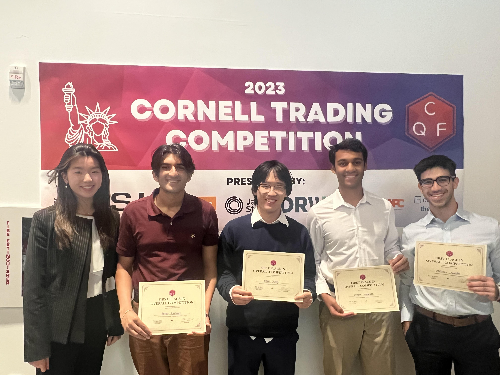

Here are some very casual and fun competitions I've participated in with friends!

---

## Cornell Trading Competition

This was an algorithmic trading/data science competition held by the Cornell Quant Fund. We competed against undergraduate and graduate teams from other schools. Our team won 1st place overall.

---

## Carnegie Mellon Optiver Market Making Game

Our team competed against teams consisting of fellow undergraduate and graduate CMU students. Our team won third place in estimation, which involved solving some math questions and brainteasers.

---
